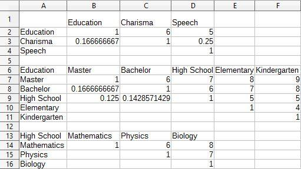

# A Facilitator for Complex Decision Making Processes

Decision making is one of the most frequent tasks that humans perform every day. Although most decisions are rather simple, it is usually challenging to solve the problems of corporates without the use of tools and algorithms.

### Value Proposition
The program facilitates complex decision making problems that compose of arbitrarily  many parameters, which is overwhelming for the human brain.
Decisions are performed by gathering the importance of each parameter (the so called "weights"), feeding them into the Analytical Hierarchical Process Algorithm and logging the results using log4j2 library for performance concerns.

### Prerequisites
- Decision problem to be facilitated.
- CSV File containing the corresponding weights (precedences) for each parameter.

### Requirements
- Analytical Hierarchical  Process Algorithm for evaluation.
- Apache Commons Math3 Library for the execution of the Analytical Hierarchical  Process Algorithm.
- log4j2 Logging Library.
- OpenCSV Library to import the weights from CSV file.

### Structure of the program as the Input-Process-Output Model
+ Input
  + A CSV file is taken as an input. It can be created using any Office program such as LibreOffice and etc.
	The only thing to pay attention while creating the CSV file is its format. It is ought to be as below;  
	+ Character Set:'Unicode (UTF-8)'
	+ Field Delimiter:','
	+ Text Delimiter:'"'
	+ Floating Point Numbers have to use '.' Character as the Radix Character to separate the integer part of the Comparative  Degree from it's fractional part
	+ Only the checkbox 'Save cell content as shown' should be checked.
		
  + A spreadsheet is used in the creation of the CSV File which also has to follow a format. 
    + Matrix must be committed at the left-top part of the file, one below another respecting the hierarchy, followed by an empty row to indicate end of the Matrix.  
    + The values of the diagonal cells of the Matrix must be 1. First Cell of the Matrix contains it's Label. Label is used to indicate the relation between Matrix. Label of the Root Matrix is left empty.  
    + Comparative Degrees have to be added to the upper triangular part of the Matrix. Inputs for the lower triangular part are ignored and the program calculates ignored values from the upper triangular part of the Matrix.  
    + Matrixes are also followed by an empty column and cells beyond the empty column are ignored. Those cells can be used for commenting purposes.  
    + Comparative Values has to be numeric and different from 0.  

+ Output  
	+ For outputting, log4j library is used. With the help of a Config File, this logger lets the user decide on the level of logging.
		One of the log levels Debug, Info or Error are to be chosen. Their priorities are as followed and once a level is chosen, levels with lower priorities are also displayed.
		These levels mentioned are the 'Root Level' which is located at the 'log4j2.xml' configuration file.
  
+ Side Effects   
    This program doesn't modify the input file. Therefore, it doesn't have any side effects.
  
+ Processing Logic   
The program uses AHP Algorithm to calculate the weights of given criteria. Commons-Math3, OpenCSV and Log4j libraries are used.

+ Exceptions  
	The program throws 2 custom Exceptions:
	+ InvalidInputException-Thrown if any Comparative Degree is not numeric.
	+ InvalidValueasComparativeDegreeException-Thrown if any Comparative Degree is 0.
  
### Sample Input

  

### Sample Output (Log File)
18:10:43.447 [main] INFO  com.decisionFacilitation.ahp.WeightsAHP -   
Consistency Index: 0.0816172661339456  
Consistency Ratio: 9.068585125993955%  
  
18:10:43.448 [main] INFO  com.decisionFacilitation.ahp.WeightsAHP - Weights  
18:10:43.450 [main] INFO  com.decisionFacilitation.ahp.WeightsAHP - Education: 70.90526651547414  
18:10:43.450 [main] INFO  com.decisionFacilitation.ahp.WeightsAHP - Charisma: 7.91105362330272  
18:10:43.450 [main] INFO  com.decisionFacilitation.ahp.WeightsAHP - Speech: 21.18367986122314  
18:10:43.451 [main] INFO  com.decisionFacilitation.ahp.WeightsAHP -  
Consistency Index: 0.22573049660805333  
Consistency Ratio: 18.204072307101075%  
  
18:10:43.451 [main] INFO  com.decisionFacilitation.ahp.WeightsAHP - Weights  
18:10:43.451 [main] INFO  com.decisionFacilitation.ahp.WeightsAHP - Master: 40.79028205087167  
18:10:43.451 [main] INFO  com.decisionFacilitation.ahp.WeightsAHP - Bachelor: 17.840690537526008  
18:10:43.451 [main] INFO  com.decisionFacilitation.ahp.WeightsAHP - High School: 7.085999597348055  
18:10:43.451 [main] INFO  com.decisionFacilitation.ahp.WeightsAHP - Elementary: 3.349218674158115  
18:10:43.452 [main] INFO  com.decisionFacilitation.ahp.WeightsAHP - Kindergarten: 1.8390756555702952  
18:10:43.452 [main] INFO  com.decisionFacilitation.ahp.WeightsAHP -  
Consistency Index: 0.15669145255400752  
Consistency Ratio: 17.410161394889723%  
  
18:10:43.452 [main] INFO  com.decisionFacilitation.ahp.WeightsAHP - Weights  
18:10:43.453 [main] INFO  com.decisionFacilitation.ahp.WeightsAHP - Mathematics: 5.204209163899872  
18:10:43.453 [main] INFO  com.decisionFacilitation.ahp.WeightsAHP - Physics: 1.5074974766065161  
18:10:43.453 [main] INFO  com.decisionFacilitation.ahp.WeightsAHP - Biology: 0.3742929568416666  
 	
